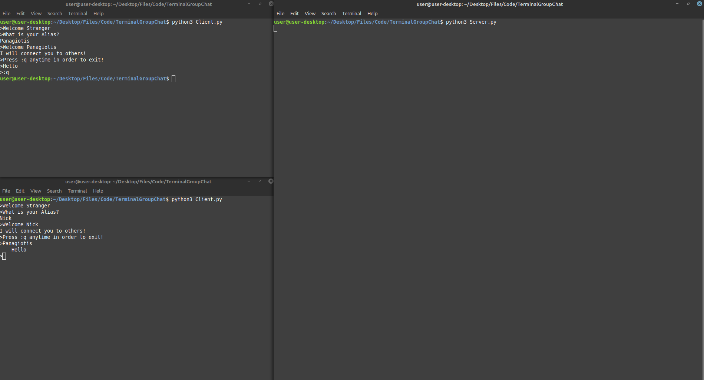

Group chat in terminal!   

Based on [this article](https://www.nagekar.com/2014/12/lan-group-messenger-in-python.html).

## Steps
1. Install the latest Python3.
2. Pip install the necessary libraries.
3. Run and have fun :)

## Example

## Libaries used

- [socket](https://docs.python.org/3/library/socket.html)
- [string](https://docs.python.org/2/library/string.html)
- [select](https://docs.python.org/3/library/select.html)
- [sys](https://docs.python.org/3/library/sys.html)

## Authors

- Kompis Panagiotis

## License

This project is licensed under the MIT License see the [LICENSE.md](https://github.com/PKompis/TerminalGroupChat/blob/main/LICENSE) file for details.